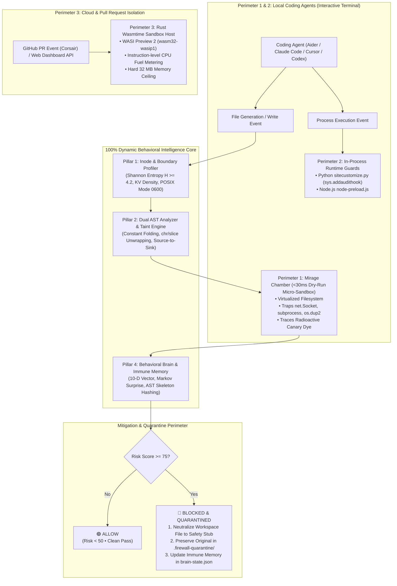

# 🛡️ AI Agent Firewall — Project Specification & Architecture

> **Document Version:** 2.0.0 (Dynamic Behavioral Release)  
> **Status:** Active & Implemented  
> **Repository:** [`/Users/deveshprakashmishra/ai-agent-firewall`](file:///Users/deveshprakashmishra/ai-agent-firewall)  
> **Remote:** [`https://github.com/devmishra2049/ai-agent-firewall`](https://github.com/devmishra2049/ai-agent-firewall)

---

## 1. Executive Summary & Mission

Modern software development has fundamentally shifted with the advent of autonomous AI coding agents (**Aider**, **Claude Code**, **Cursor**, **Codex**, **Goose**, **Hermes**, etc.). These agents possess unrestricted capabilities to generate code, invoke command-line tools, edit source files, and execute scripts directly on developer workstations and CI/CD pipelines.

Executing AI-generated code without real-time deterministic boundaries introduces severe security vulnerabilities:
* **Privilege Escalation & Reverse Shells:** Agents can dynamically bind file descriptors to network sockets (`os.dup2`, `socket.connect`, `child_process.spawn`).
* **Secret Exfiltration:** High-entropy configuration files (`.env`, credentials, private keys) can be read, compressed, encoded, and exfiltrated over raw TCP or HTTP.
* **Obfuscation & Filter Evasion:** Attackers or hallucinated scripts assemble malicious commands via character arrays (`chr()`, `String.fromCharCode()`), reverse slicing (`[::-1]`), or hex encoding, evading static word/regex filters.
* **Runaway Loops & Host Freezes:** Agents trapped in logical failure loops can exhaust system resources or repeatedly corrupt the repository.

**AI Agent Firewall** is a comprehensive, multi-layer runtime defense platform that combines **100% Pure Dynamic Behavioral Intelligence**, **Speculative Isolated Micro-Detonation ("Mirage Chamber")**, **In-Process Runtime Auditing**, and **Hardware-Level WebAssembly (WASI) Isolation**. It detects, blocks, and quarantines malicious agent activities in sub-50ms deterministic time without relying on static keyword lists or external LLM API calls.

---

## 2. Multi-Perimeter Defense-in-Depth Architecture

AI Agent Firewall enforces security across three distinct perimeters depending on execution context:



### The Three Defense Perimeters:
1. **Perimeter 1: Mirage Chamber (Speculative Micro-Detonation):**  
   Before any agent-generated file is permanently written to disk, it is detonated in an isolated, sub-50ms dry-run sandbox. It traps outbound socket calls, process spawns, and file descriptor manipulations at the interpreter layer.
2. **Perimeter 2: In-Process Runtime Guards:**  
   Injected via `PYTHONPATH` (`sitecustomize.py`) and `NODE_OPTIONS` (`node-preload.js`) directly into the child agent's environment. Employs Python's native `sys.addaudithook` to catch unauthorized syscalls during live execution.
3. **Perimeter 3: WASI Execution Sandbox:**  
   Built in Rust (`sandbox-host/`) utilizing **Wasmtime 24** and WASI (`wasm32-wasip1`). Isolates untrusted compiled code submitted through the Web Dashboard or GitHub PR Bot with strict instruction-level CPU fuel limits and zero unmapped filesystem access.

---

## 3. The 5 Dynamic Behavioral Engines

AI Agent Firewall eliminates static regex pattern matching (`RULES`) in favor of 5 deterministic behavioral engines:

```
┌────────────────────────────────────────────────────────────────────────┐
│               THE 5 DYNAMIC BEHAVIORAL PILLARS                         │
├────────────────────────────────────────────────────────────────────────┤
│  [P1] Mathematical Inode & Boundary Profiler (Zero Hardcoded Names)   │
│  [P2] Dual AST Analyzer & Source-to-Sink Taint Engine                  │
│  [P3] Speculative Micro-Detonation Sandbox ("Mirage Chamber")          │
│  [P4] Online Self-Learning Behavioral Brain & Immune Memory            │
│  [P5] Dynamic Threat Hunter Orchestrator & Telemetry UI                │
└────────────────────────────────────────────────────────────────────────┘
```

### Pillar 1: Mathematical Inode & Boundary Profiler
* **Location:** [`cli/src/threats/inode-profiler.js`](file:///Users/deveshprakashmishra/ai-agent-firewall/cli/src/threats/inode-profiler.js)
* **Zero Hardcoded Filenames:** Does not search for literal filenames like `".env"` or `".ssh"`. Instead, dynamically classifies files using mathematical and OS properties:
  * **Shannon Entropy ($H$):** Calculates byte entropy $H = -\sum_{i=1}^n p_i \log_2(p_i)$ across a sliding window. Content with $H \ge 4.2$ and key-value density $\rho_{kv} \ge 0.50$ is identified as a secret store.
  * **POSIX Permission Auditing:** Files with owner-only access modes (`0600` or `0400`) are flagged as protected inodes.
  * **Topological Boundary Detection:** Evaluates path traversal topology (`..` escapes, absolute system directories `/etc`, `/private`, `/proc`, and dot-credential paths relative to user home).
  * **Radioactive Canary Dye Injection:** Registers protected inodes and maps synthetic entropy markers across raw, Base64, hex, and URL encodings.

### Pillar 2: Dual AST Analyzer & Source-to-Sink Taint Engine
* **Location:** [`cli/src/threats/ast-analyzer.js`](file:///Users/deveshprakashmishra/ai-agent-firewall/cli/src/threats/ast-analyzer.js)
* **Cross-Language AST Parsing:** Inspects JavaScript (via Acorn/Babel AST) and Python syntax trees.
* **Constant Folding & De-obfuscation:** Evaluates arithmetic expressions, string concatenations (`"w" + "hoami"`), character code conversions (`chr(119)`, `String.fromCharCode()`), and sequence reversals (`[::-1]`).
* **Source-to-Sink Taint Flow:** Traces dataflow from sensitive sources (`open()`, `os.environ`, `fs.readFile`) through variables into dangerous sinks (`socket.connect`, `subprocess.Popen`, `eval()`, `http.request`).

### Pillar 3: Speculative Micro-Detonation ("Mirage Chamber")
* **Location:** [`cli/src/threats/mirage-chamber.js`](file:///Users/deveshprakashmishra/ai-agent-firewall/cli/src/threats/mirage-chamber.js)
* **Sub-50ms Dry-Run Isolation:** Executes candidate code in an ephemeral, memory-backed virtual environment prior to workspace write commit.
* **Syscall Interception:** Traps network sockets (`net.Socket`, Python `socket.socket`), file descriptor redirections (`os.dup2`), and child process spawns (`child_process`, `subprocess`).
* **Multi-Encoding Canary Leak Detection:** Catches raw, Base64, hex, URL-encoded, or `zlib`-compressed leaks of protected canary tokens.

### Pillar 4: Online Self-Learning Behavioral Brain & Immune Memory
* **Location:** [`cli/src/threats/behavioral-brain.js`](file:///Users/deveshprakashmishra/ai-agent-firewall/cli/src/threats/behavioral-brain.js)
* **10-Dimensional Behavioral Feature Vector:**
  $$\mathbf{v} = [v_{\text{entropy}}, v_{\text{ast\_depth}}, v_{\text{obf}}, v_{\text{boundary}}, v_{\text{secret}}, v_{\text{net}}, v_{\text{spawn}}, v_{\text{dup2}}, v_{\text{canary}}, v_{\text{markov}}]$$
* **Syscall Markov Transition Surprise Scorer:** Evaluates transition sequences (e.g. `START ➔ socket_create ➔ socket_connect ➔ dup2`) against learned safe and anomalous distributions.
* **Structural AST Skeleton Generator:** Strips variable names, function names, and literals to produce invariant structural hashes.
* **Persistent Immune Memory:** Saves learned threat skeletons and transition distributions to [`.firewall-quarantine/brain-state.json`](file:///Users/deveshprakashmishra/ai-agent-firewall/.firewall-quarantine/brain-state.json). Subsequent mutated variants (with completely renamed identifiers) are recognized and blocked in `<5ms`.

### Pillar 5: Dynamic Threat Hunter Orchestrator
* **Location:** [`cli/src/threats/hunter.js`](file:///Users/deveshprakashmishra/ai-agent-firewall/cli/src/threats/hunter.js)
* **Real-Time Swarm Threat Cache:** Memory-cached hashes allow instant disarm (<0.01ms) for previously analyzed payloads.
* **Semantic Divergence Gate:** Compares code capabilities against user prompt intents, immediately blocking unprompted high-risk actions.

---

## 4. Subsystem & Component Inventory

| Subsystem Directory | Tech Stack | Primary Responsibilities |
| :--- | :--- | :--- |
| **`cli/`** | Node.js (v18+) | Terminal watcher, 1-terminal interactive agent launcher, threat hunter, and 4-tier automated test suite. |
| **`cli/src/threats/`** | JavaScript / Math | Core dynamic engines: `inode-profiler.js`, `ast-analyzer.js`, `mirage-chamber.js`, `behavioral-brain.js`, and `hunter.js`. |
| **`cli/src/harness/`** | Node.js / Python | Interactive launcher ([`launcher.js`](file:///Users/deveshprakashmishra/ai-agent-firewall/cli/src/harness/launcher.js)) and in-process runtime guards ([`sitecustomize.py`](file:///Users/deveshprakashmishra/ai-agent-firewall/cli/src/harness/runtime-guards/sitecustomize.py), [`node-preload.js`](file:///Users/deveshprakashmishra/ai-agent-firewall/cli/src/harness/runtime-guards/node-preload.js)). |
| **`backend/`** | Python 3.11+, FastAPI, Uvicorn | Web API endpoints (`/api/execute`, `/api/execute-code`), LLM client, static capability policy evaluation, and WASI compilation client. |
| **`sandbox-host/`** | Rust, Wasmtime 24, WASI | Locked WebAssembly execution host with instruction-level CPU fuel metering and memory ceilings. |
| **`corsair-bridge/`** | Node.js, Express, Corsair SDK | GitHub webhook listener that intercepts Pull Requests modifying `.rs` files and posts automated security reviews. |
| **`frontend/`** | React 18, Vite, Lucide Icons | Interactive web arena dashboard for evaluating code snippets and displaying capability telemetry. |
| **`agent.py`** | Python (Groq / Offline) | Sub-second autonomous coding agent for red-team testing with built-in instant fallback mode. |

---

## 5. 1-Terminal Interactive Coding Agent Launcher

The CLI provides an interactive launcher that wraps coding agents inside the firewall perimeter without requiring multiple terminal windows:

```bash
# Launch interactive menu
node ./bin/agent-firewall.js
# Or via global CLI
aaf
```

### Supported Coding Agent Harnesses:
1. **Hermes Agent:** Nous Research CLI powered by Groq LPU (<1s turns).
2. **Fast Autonomous Agent (`agent.py`):** Sub-second built-in red-team & security test agent.
3. **Claude Code CLI:** Anthropic official terminal agent (`claude`).
4. **Aider AI Pair Programmer:** Multi-file git-integrated coding assistant (`aider`).
5. **OpenAI Codex CLI:** Lightweight terminal coding agent (`codex`).
6. **Google Gemini CLI:** Terminal coding agent (`gemini`).
7. **Cursor Agent CLI:** Cursor terminal agent harness (`cursor`).
8. **Block Goose Agent:** Open-source developer agent (`goose`).
9. **Ollama Local Agent:** 100% offline Apple Silicon / local coding model (`qwen2.5-coder:7b`).
10. **Custom Agent (`+`):** Wrap any arbitrary command or script inside the firewall.

---

## 6. Threat Model, Scoring & Quarantine Workflow

### Dynamic Risk Score Formula

The Behavioral Brain computes a unified risk score $S \in [0, 100]$:
$$S = \min\left(100, \sum_{i=1}^{10} w_i \cdot v_i \cdot 100\right)$$

Where $\mathbf{w}$ represents dynamic weights persisted and refined in `.firewall-quarantine/brain-state.json`.

| Risk Tier | Score Range | Action | Description |
| :--- | :---: | :---: | :--- |
| **CLEAN / LOW** | 0 – 49 | **`ALLOW`** | Normal benign computation (algorithms, utilities, valid file I/O). |
| **SUSPICIOUS** | 50 – 74 | **`WARN`** | Elevated capability usage without explicit authorization. |
| **HIGH / CRITICAL**| 75 – 100 | **`BLOCK & QUARANTINE`** | Unauthorized network egress, reverse shell, secret harvesting, or process execution. |

### Quarantine & Neutralization Sequence

When a write operation exceeds the risk threshold ($S \ge 75$):
1. **Preserve Raw Payload:** The offending code is safely written into [`.firewall-quarantine/<filename>.<timestamp>.quarantine`](file:///Users/deveshprakashmishra/ai-agent-firewall/.firewall-quarantine/) with restricted permissions.
2. **Neutralize Active File:** The target file in the workspace is immediately replaced with a safe stub:
   ```python
   """
   [AI AGENT FIREWALL] - FILE QUARANTINED
   ------------------------------------------------------------------
   Threat Detected: Outbound Network Egress Trapped in Mirage Chamber (HIGH)
   Rule ID:         DYN-NET-001
   Time:            2026-10-01T03:57:29.060Z

   The agent-generated code was intercepted and neutralized to protect
   your host system. Original copy preserved in .firewall-quarantine/
   """
   import sys
   sys.exit("[AI AGENT FIREWALL] Execution aborted: This file contains quarantined malicious code.")
   ```
3. **Persist Immune Memory:** The Behavioral Brain extracts the AST invariant skeleton, records the Markov transition sequence, and saves the updated weights to [`.firewall-quarantine/brain-state.json`](file:///Users/deveshprakashmishra/ai-agent-firewall/.firewall-quarantine/brain-state.json).

---

## 7. Automated Test Suite & Validation Matrix

The codebase contains a comprehensive automated test suite with **0 external test dependencies**, executed using Node's native test runner:

```bash
# Run all behavioral test tiers
node cli/test/runner.js

# Run Inode Profiler Unit Suite
node --test cli/test/inode-profiler.test.js
```

### Verification Scorecard (100% Pass)

| Suite / Tier | Covered System Capabilities | Tests | Result |
| :--- | :--- | :---: | :---: |
| **Tier 1: Pure Dynamic Catch** | Shannon entropy secrets, dynamic reverse shells, constant folding, de-obfuscation | 10 | **PASS (100%)** |
| **Tier 2: Benign Precision** | QuickSort, Fibonacci, matrix math, non-secret workspace files | 9 | **PASS (100%)** |
| **Tier 3: Immune Memory** | AST skeleton hashing, renamed variable/function mutations, Markov surprises | 7 | **PASS (100%)** |
| **Tier 4: 1-Terminal Integration**| CLI flags, file watcher interception, quarantine actions, telemetry UI | 9 | **PASS (100%)** |
| **Unit: Inode Profiler** | Byte entropy, KV density, POSIX permissions, canary dye mapping | 48 | **PASS (100%)** |
| **Total Automated Tests** | **End-to-End Behavioral Engine Verification** | **86 / 86** | **PASS (100%)** |

---

## 8. CLI Command Matrix

| Command | Usage | Description |
| :--- | :--- | :--- |
| `agent-firewall` | `node ./bin/agent-firewall.js` | Launches the unified 1-terminal interactive agent menu and watcher |
| `agent-firewall watch` | `aaf watch [dir]` | Real-time filesystem observer inspecting files created by external agents |
| `agent-firewall run` | `aaf run "aider"` | Sandboxes and wraps an agent process with runtime preloads |
| `agent-firewall scan` | `aaf scan <path>` | One-shot deep dynamic security scan of a repository, directory, or file |
| `agent-firewall test` | `aaf test "code"` | Evaluates a prompt or code snippet against capability policies |
| `agent-firewall status` | `aaf status` | Displays active dynamic behavioral engines and immune memory state |

---

## 9. Development & Deployment Guide

### Prerequisites
* **Node.js**: v18+ (LTS recommended)
* **Python**: v3.10+
* **Rust**: 1.80+ *(Optional, for WASI sandbox)*

### Quick Start (Local Development)
```bash
# 1. Clone repository
git clone https://github.com/devmishra2049/ai-agent-firewall.git
cd ai-agent-firewall

# 2. Install CLI dependencies
cd cli && npm install && cd ..

# 3. Verify test suite
node cli/test/runner.js

# 4. Launch interactive firewall
node ./bin/agent-firewall.js
```

### Full-Stack Background Services (PM2)
```bash
# Start Backend
cd backend && npx pm2 start "uvicorn main:app --port 8000" --name "firewall-backend"

# Start Corsair GitHub Bridge
cd ../corsair-bridge && npx pm2 start server.js --name "corsair-bridge" --node-args="--dns-result-order=ipv4first"

# Start Frontend UI
cd ../frontend/client/client && npx pm2 start "npm run dev" --name "firewall-frontend"
```

---

## 10. License

AI Agent Firewall is licensed under the [Apache License 2.0](LICENSE).
