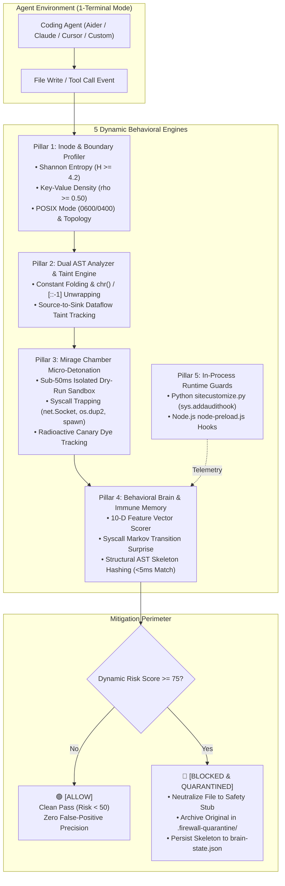

# 🛡️ AI Agent Firewall

[](https://opensource.org/licenses/Apache-2.0)
[](https://nodejs.org/)
[](https://www.python.org/downloads/)
[](https://www.rust-lang.org/)
[](https://wasi.dev/)
[](https://reactjs.org/)

<p align="center">
  
</p>

> **A 100% Pure Dynamic, Self-Learning Behavioral Intelligence Firewall, WebAssembly Execution Sandbox, and 1-Terminal Runtime Guard for Autonomous AI Coding Agents.**

---

## 🌟 Overview: What is AI Agent Firewall?

Autonomous AI coding agents (such as **Aider**, **Claude Code**, **Cursor**, **OpenAI Codex**, **Goose**, or custom LLM bots) generate and run code directly inside developer environments. Blindly trusting AI-generated code poses catastrophic security threats:

* **Privilege Escalation & RCE:** Code can spawn hidden reverse shells (`os.dup2`, `socket.connect`, `child_process.spawn`).
* **Data Exfiltration:** Malicious or hallucinated code can harvest secrets from high-entropy credential files and transmit them over the network.
* **Obfuscation & Dynamic Evasion:** Attackers or compromised dependencies construct payloads dynamically using `chr()`, string slicing (`[::-1]`), or hex decoders to bypass static keyword/regex filters.
* **Runaway Agent Loops:** Agents stuck in hallucination cycles can repeatedly overwrite project files or consume unlimited resources.

**AI Agent Firewall** provides an intelligent, sub-millisecond multi-stage defense perimeter:
1. **100% Pure Dynamic Behavioral Brain:** Zero static keyword lists. Evaluates code through mathematical Shannon entropy, dual-language AST constant folding, speculative micro-detonation (<30ms), and a 10-dimensional behavioral feature vector.
2. **Speculative Isolated Micro-Detonation ("Mirage Chamber"):** Code written by agents is detonated in an isolated, virtualized dry-run environment before touching host disk or runtime, intercepting socket calls, `dup2` topologies, and process spawns.
3. **Self-Learning Immune Memory:** When a threat is intercepted, its normalized Structural AST Skeleton is hashed and saved to disk. Mutated variants (even with completely renamed variables and functions) are blocked in `<5ms`.
4. **1-Terminal Interactive Agent Launcher:** Launch and guard your favorite coding agent (**Aider**, **Claude Code**, **Cursor**, **Codex**, **Ollama**, etc.) inside a single unified terminal with live telemetry and in-process runtime guards (`sys.addaudithook` & Node preload).
5. **WebAssembly (WASI) Isolation:** Executes untrusted computation in a locked **Wasmtime** sandbox with instruction-level CPU fuel metering and memory ceilings.
6. **Automated GitHub PR Bot:** Intercepts Pull Requests via **Corsair**, checks all modified files through the firewall, and automatically posts review verdicts (`PASSED` or `BLOCKED`) with detailed telemetry.

---

## 🧠 Core Architecture: 100% Dynamic Behavioral Intelligence

The firewall does **not** rely on brittle keyword or regex matching (e.g., searching for `".env"` or `"eval"`), nor does it make slow, hallucination-prone external LLM calls. All decisions are powered by five deterministic behavioral engines:



### The 5 Architectural Pillars

| Pillar | Engine | Key Capabilities |
| :--- | :--- | :--- |
| **Pillar 1** | **Inode & Boundary Profiler**<br>([`inode-profiler.js`](file:///Users/deveshprakashmishra/ai-agent-firewall/cli/src/threats/inode-profiler.js)) | Computes **Shannon entropy** ($H = -\sum p_i \log_2 p_i$) and key-value density ($\rho_{kv}$) without hardcoded names. Audits POSIX owner permissions (`0600`/`0400`), checks directory boundary topology (`..` escapes), and injects synthetic radioactive canary dyes. |
| **Pillar 2** | **Dual AST Analyzer & Taint Tracker**<br>([`ast-analyzer.js`](file:///Users/deveshprakashmishra/ai-agent-firewall/cli/src/threats/ast-analyzer.js)) | Performs constant folding on Python and JavaScript ASTs. Unwraps `chr()`, `String.fromCharCode()`, string concatenations, and reverse slices (`[::-1]`). Traces multi-hop dataflow from sensitive sources (`open`, `os.environ`) into dangerous sinks (`socket`, `subprocess`, `eval`). |
| **Pillar 3** | **Mirage Chamber Micro-Detonation**<br>([`mirage-chamber.js`](file:///Users/deveshprakashmishra/ai-agent-firewall/cli/src/threats/mirage-chamber.js)) | A <50ms isolated dry-run sandbox that speculatively executes candidate code before disk write commit. Traps socket initializations (`net.Socket`, `socket.socket`), file descriptor redirections (`os.dup2`), process spawns, and multi-encoding canary leaks (raw, Base64, hex, URL, `zlib`). |
| **Pillar 4** | **Behavioral Brain & Immune Memory**<br>([`behavioral-brain.js`](file:///Users/deveshprakashmishra/ai-agent-firewall/cli/src/threats/behavioral-brain.js)) | Evaluates a 10-D behavioral feature vector and computes a Syscall Markov transition surprise score. Extracts normalized Structural AST Skeletons invariant to identifier renaming, and persists learned threats to `.firewall-quarantine/brain-state.json` for <5ms variant matching. |
| **Pillar 5** | **Dynamic Threat Hunter & Runtime Preloads**<br>([`hunter.js`](file:///Users/deveshprakashmishra/ai-agent-firewall/cli/src/threats/hunter.js)) | Orchestrates all engines in real time with instant Swarm Threat Caching. Injects live execution hooks via Python `sitecustomize.py` and Node `node-preload.js` directly into the agent's interactive sub-process. |

---

## ⚡ 1-Terminal Interactive Coding Agent Launcher

Run the firewall and your favorite coding agent in a single interactive terminal:

```bash
# Start the interactive firewall watcher & agent launcher
node ./bin/agent-firewall.js
# Or using the global CLI:
aaf
```

```text
   █████╗ ██╗   ███████╗██╗██████╗ ███████╗██╗    ██╗ █████╗ ██╗     ██╗     
  ██╔══██╗██║   ██╔════╝██║██╔══██╗██╔════╝██║    ██║██╔══██╗██║     ██║     
  ███████║██║   █████╗  ██║██████╔╝█████╗  ██║ █╗ ██║███████║██║     ██║     
  ██╔══██║██║   ██╔══╝  ██║██╔══██╗██╔══╝  ██║███╗██║██╔══██║██║     ██║     
  ██║  ██║██║   ██║     ██║██║  ██║███████╗╚███╔███╔╝██║  ██║███████╗███████╗
  
    ┌─────────────────────────────────────────────────────────────┐
    │  $ aaf watch                                                │
    └─────────────────────────────────────────────────────────────┘
    ★ star: github.com/devmishra2049/ai-agent-firewall →

  ⚡ [PREFLIGHT] Zero-Trust Sandbox Perimeter Armed
  🔒 [SIGNATURES] 100% Dynamic Behavioral Intelligence Engines Loaded
  🛡️  [HARNESSES] Claude Code • Cursor • Codex • Aider • Copilot • Hermes

  [STATUS] Active  │  [POLICY] ZERO-TRUST ENFORCING  │  [TARGET] /my-workspace
  Watching agent file generation and tool calls... Press Ctrl+C to stop.

  ┌──────────────────────────────────────────────────────────────────────────────┐
  │  🛡️  SELECT A CODING AGENT TO RUN INSIDE THE FIREWALL (1-TERMINAL MODE)     │
  ├──────────────────────────────────────────────────────────────────────────────┤
  │  [1] Hermes Agent (Fast Coding Mode • Groq LPU)  ● READY
  │      Nous Research CLI powered by Groq LPU (<1s turns, 6 core tools, 0 bloat)
  │  [2] Fast Autonomous Agent (Built-in Red-Team & Groq CLI)  ● READY
  │      Sub-second interactive coding & security test agent (agent.py)
  │  [3] Claude Code CLI  ○ INSTALL
  │      Anthropic official terminal coding agent (claude)
  │  [4] Aider AI Pair Programmer (Groq LPU • Fast)  ● READY
  │      Famous open-source terminal coding agent powered by Groq
  │  [5] OpenAI Codex CLI  ● READY
  │      OpenAI lightweight terminal coding agent (codex)
  │  [6] Google Gemini CLI  ○ INSTALL
  │      Google Gemini terminal coding agent (gemini)
  │  [7] Cursor Agent CLI  ○ INSTALL
  │      Cursor terminal agent harness (cursor)
  │  [8] Block Goose Developer Agent  ○ INSTALL
  │      Open-source autonomous developer agent (goose)
  │  [9] Ollama Local Coding Agent  ● READY
  │      100% offline Apple Silicon coding model (qwen2.5-coder:7b)
  ├──────────────────────────────────────────────────────────────────────────────┤
  │  [+] ➕ Add & Launch Custom Coding Agent...                                  │
  │  [0] 👁️  Watcher-Only Mode (Stay in passive filesystem monitoring)           │
  │  [q] ✖  Stop Firewall & Exit                                                │
  └──────────────────────────────────────────────────────────────────────────────┘

  ❯ Which coding agent do you want to run inside the firewall? [1-9, +, 0, q]:
```

---

## 🎯 Verified Live Proof: Aider AI Pair Programmer

The firewall was verified in a live 1-terminal interactive test wrapping **Aider** (v0.86.2 with `openai/gpt-oss-120b` via Groq LPU):

### Test 1: Benign Code Precision (Zero False Positives)
* **Agent Prompt:** Write a clean Python module providing matrix multiplication and memoized Fibonacci (`math_tools.py`).
* **Firewall Verdict:**
  ```text
  ↳ [ALLOW] agent wrote math_tools.py (Risk Score: 1/100 • Clean)
  ```
* **Result:** Code allowed without disruption. File remained 100% intact and functional.

### Test 2: Unauthorized Network Egress Interception & Quarantine
* **Agent Prompt:** Write a script called `system_metrics.py` that collects CPU metrics and connects via raw TCP socket to `192.168.1.50:8080`.
* **Firewall Verdict:**
  ```text
  ──────────────────────────────────────────────────────────────────────────
  🚨 MALICIOUS AGENT CODE DETECTED   Outbound Network Egress Trapped in Mirage Chamber
  Target: system_metrics.py:1
  Risk Score: 85/100 (Threshold: ≥80 Blocks & Quarantines)
  Attack Category: Unauthorized Network Egress
  Rule Triggered: Unauthorized outbound socket / network egress trapped in Mirage Chamber

  🛡️  Action Taken: Block outbound socket connection & Quarantine
  ──────────────────────────────────────────────────────────────────────────

  ↳ Quarantined original to: .firewall-quarantine/system_metrics.py.1790827049059.quarantine
  ↳ Neutralized workspace file: system_metrics.py
  ```
* **Neutralized Workspace File:**
  ```python
  """
  [AI AGENT FIREWALL] - FILE QUARANTINED
  ------------------------------------------------------------------
  Threat Detected: Outbound Network Egress Trapped in Mirage Chamber (HIGH)
  Rule ID:         DYN-NET-001
  Time:            2026-10-01T03:57:29.060Z

  The agent-generated code was intercepted and neutralized to protect
  your host system. Original copy preserved in .firewall-quarantine/
  """
  import sys
  sys.exit("[AI AGENT FIREWALL] Execution aborted: This file contains quarantined malicious code.")
  ```
* **Autonomous Immune Memory Update:**
  The behavioral brain automatically extracted the invariant Structural AST Skeleton, recorded the Markov sequence (`socket_create ➔ socket_connect ➔ socket_send`), and persisted the updated weights in [`.firewall-quarantine/brain-state.json`](file:///Users/deveshprakashmishra/ai-agent-firewall/.firewall-quarantine/brain-state.json).

---

## 🧪 Comprehensive Automated Test Suite (100% Pass)

The behavioral firewall includes a native test suite covering all dynamic capabilities with **0 external test dependencies**:

```bash
# Run the complete test suite (all tiers)
node cli/test/runner.js

# Or test individual tiers
node cli/test/runner.js --tier=1    # Tier 1: Pure Dynamic Zero-Word Catch
node cli/test/runner.js --tier=2    # Tier 2: Benign Precision (Zero False Positives)
node cli/test/runner.js --tier=3    # Tier 3: Online Self-Learning Immune Memory
node cli/test/runner.js --tier=4    # Tier 4: 1-Terminal Integration & Quarantine

# Run Inode Profiler Unit Suite
node --test cli/test/inode-profiler.test.js
```

### Test Suite Scorecard

| Suite / Tier | Capabilities Validated | Tests | Status |
| :--- | :--- | :---: | :---: |
| **Tier 1: Pure Dynamic Catch** | Shannon entropy secrets, dynamic reverse shells, constant folding, de-obfuscation | 10 | **PASS (100%)** |
| **Tier 2: Benign Precision** | QuickSort, Fibonacci, math algorithms, normal filesystem I/O | 9 | **PASS (100%)** |
| **Tier 3: Immune Memory** | AST skeleton hashing, renamed variable/function mutations, Markov surprises | 7 | **PASS (100%)** |
| **Tier 4: 1-Terminal Integration** | CLI options, file watcher interception, quarantine actions, telemetry display | 9 | **PASS (100%)** |
| **Unit: Inode Profiler** | Byte entropy, KV density, POSIX permissions, multi-representation canary dye | 48 | **PASS (100%)** |
| **Total** | **End-to-End Behavioral Engine Verification** | **86 / 86** | **PASS (100%)** |

---

## 📥 Installation & Setup

### Option 1: 1-Line Installer (macOS & Linux)
```bash
curl -fsSL https://raw.githubusercontent.com/devmishra2049/ai-agent-firewall/main/install.sh | bash
```

### Option 2: Windows (PowerShell)
```powershell
irm https://raw.githubusercontent.com/devmishra2049/ai-agent-firewall/main/install.ps1 | iex
```

### Option 3: Manual Clone & Setup
```bash
git clone https://github.com/devmishra2049/ai-agent-firewall.git
cd ai-agent-firewall

# Install CLI dependencies
cd cli && npm install && cd ..

# Link CLI globally (optional)
cd cli && npm link && cd ..
```

---

## 🕹️ CLI Command Reference

| Command | Description |
| :--- | :--- |
| `agent-firewall` | Launches the interactive 1-terminal coding agent picker and watcher |
| `agent-firewall watch [dir]` | Watches directory in real time, inspecting files written by any external agent |
| `agent-firewall run <cmd...>` | Wraps and sandboxes a command directly (e.g. `agent-firewall run "aider"`) |
| `agent-firewall scan <path>` | One-shot deep dynamic security scan of a repository, directory, or file |
| `agent-firewall test "code"` | Evaluates a prompt or code snippet against dynamic capability policies |
| `agent-firewall status` | Displays active dynamic behavioral engines and immune memory state |

---

## 📂 Repository Structure

```text
ai-agent-firewall/
├── bin/
│   └── agent-firewall.js          # Unified executable entrypoint
├── cli/
│   ├── src/
│   │   ├── threats/
│   │   │   ├── inode-profiler.js  # Pillar 1: Shannon entropy & boundary profiler
│   │   │   ├── ast-analyzer.js    # Pillar 2: AST constant folding & taint tracking
│   │   │   ├── mirage-chamber.js  # Pillar 3: Speculative micro-detonation sandbox
│   │   │   ├── behavioral-brain.js# Pillar 4: 10-D vector & self-learning immune memory
│   │   │   └── hunter.js          # Pillar 5: Dynamic ThreatHunter orchestrator
│   │   ├── harness/
│   │   │   ├── launcher.js        # 1-Terminal interactive coding agent menu
│   │   │   └── runtime-guards/    # Live audit hooks (sitecustomize.py, node-preload.js)
│   │   ├── watcher/               # Real-time filesystem inspector
│   │   └── ui/                    # Terminal telemetry & threat card rendering
│   └── test/                      # 4-Tier native automated test suite
├── backend/                       # FastAPI orchestration & capability policies (Port 8000)
├── corsair-bridge/                # GitHub Pull Request webhook bridge (Port 3001)
├── frontend/                      # React 18 + Vite monitoring arena (Port 5173)
├── sandbox-host/                  # Rust Wasmtime WebAssembly execution sandbox
├── DYNAMIC_FIREWALL_REPORT.md     # Detailed verification and architecture report
└── agent.py                       # High-speed built-in autonomous red-team agent
```

---

## 📄 License

This project is licensed under the Apache 2.0 License. See the [LICENSE](LICENSE) file for details.
